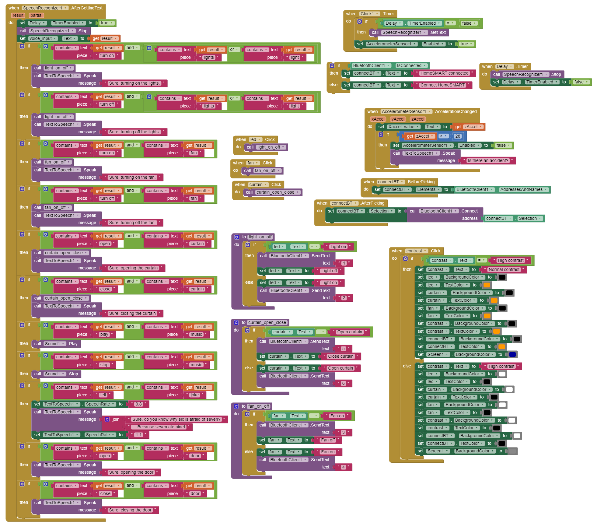

# HomeSMART
Link to video: https://youtu.be/C4ZEnElYgm8

HomeSMART is a smart home system specifically designed for persons with disabilities. The user can control home appliances (lights, fans and curtains) using voice recognition or the custom-built Mobile App. There is also proximity detection using Ultrasound to trigger motors for automatic doors. The arduino main system is programmed in C++ in Arduino to parse instructions received from mobile app via Bluetooth, and readings from sensors to control the system. A Custom API is developed that allows communication between Mobile App and Arduino System.

This is a coursework project that received grade **A** in ENGG1320 of HKU.

